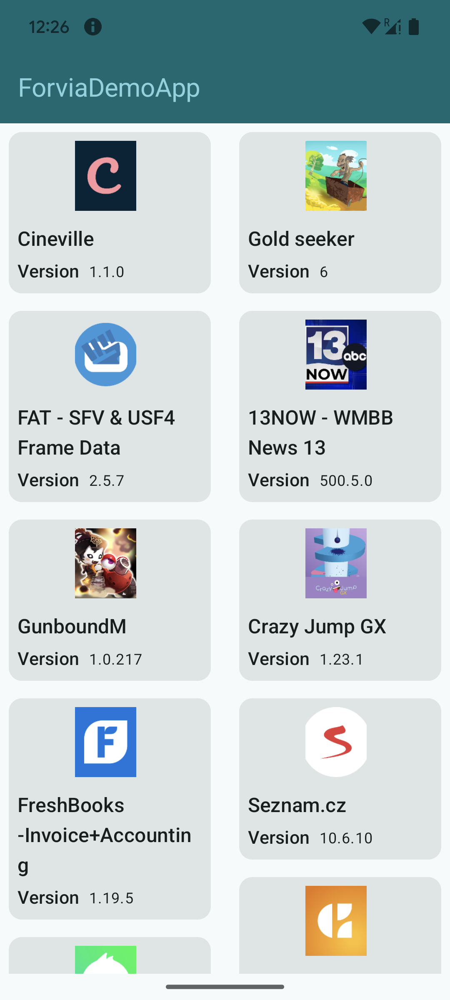
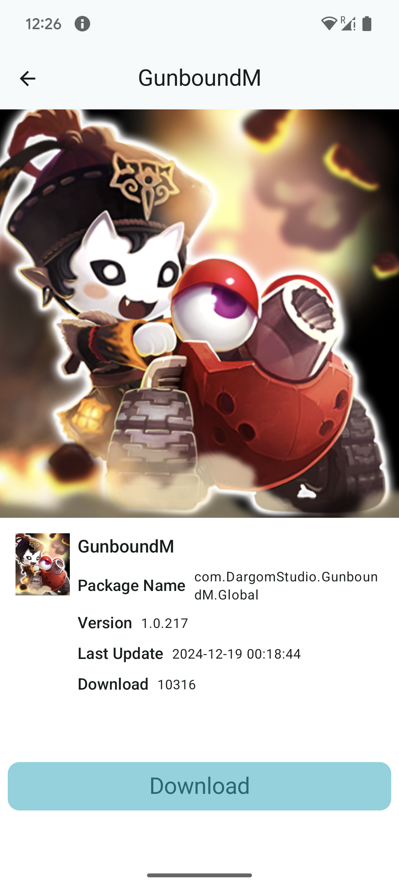
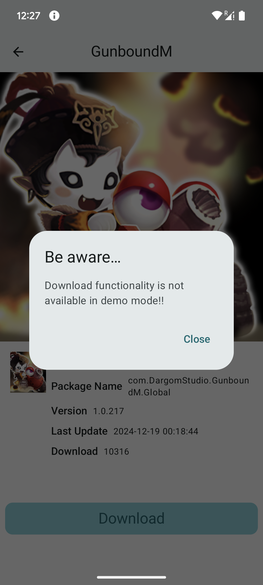
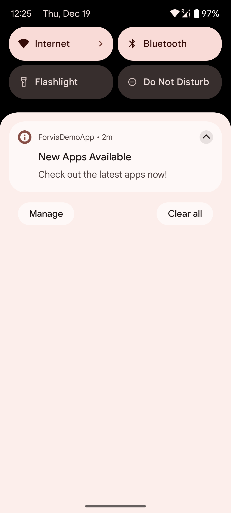
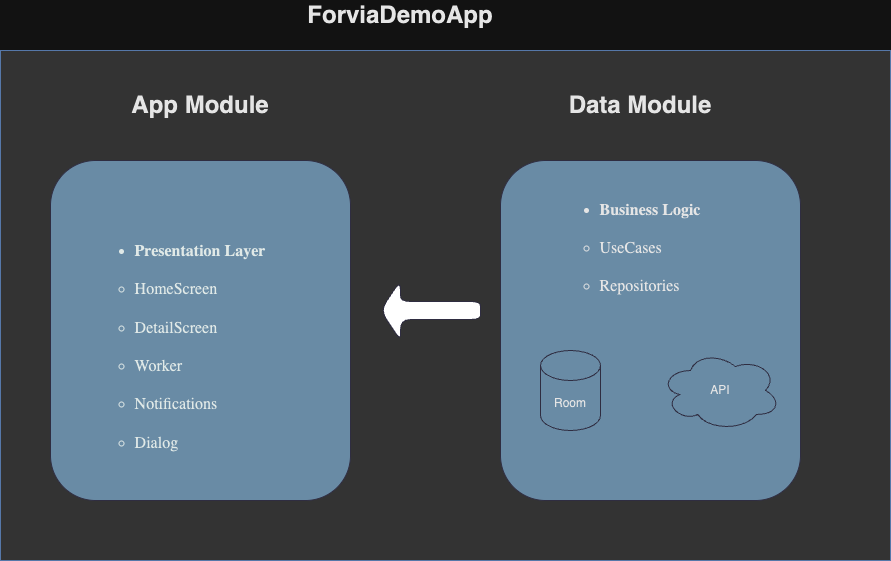

# ForviaDemoApp
Assignment for Forvia 

## Description
ForviaDemoApp list of Applications from Apptoide, send notification with updates.

## Screenshots and features

   

- **Features:**
- Get information from the api: http://ws2.aptoide.com/api/6/bulkRequest/api_list/listApps
- Save the app list on a room database so it can work even if its not connected to internet
- Send notification every 30 min warning the user of new applications
- Works in darkmode and lightmode
- Unit test, instrumentation Test for Room DB and for HomeScreen
- Loading state while fetching apps list

## Project architecture

This project draws Uncle Bob's inspiration of clean architecture. It aims to separate business rules
from implementation details such as network access, database operations and the user interface for
easier development and maintenance.

The project is split into 2 Gradle modules:

- **data** Kotlin library that defines the app's purpose (business rules). The App fetch the list of
  Applications and saves them to some form of history for later access. This module embodies the
  domain and entities layers. Originally, there was a separate *entities* module, but it only
  contained a single data class with no business rules of its own, so I removed it to keep things
  simple.

- **app** Android app module, its the presentation layer of the Application.Contains all the
  screens,
- composables, the worker to schedule the notification, and the notification itself.

  This module also manages dependency injection with Dagger Hilt and it is the only module that does
  so.
  This makes it very easy to later switch out the dependency injection framework for Koin or plain
  Dagger.

## Test

The apk can be downloaded from [APK](./apk/forvia.apk)

- IMPORTANT: The notification permissions must be enabled on device Settings in order to send
  notifications

## To do's

There is still lot of room to improvements, here is some That I've thought but could not implement:

- Request permissions at runtime
- Error scenarios(No internet, api error, etc)
- Not dealing with app (id,name,packageName being null)
- Open the app when the notification is clicked
- Just send the notification (every 30 min) if the delta between the list of app in the DB and the
  list of Apps fetch from the api is grater than 0.
- Flow tests
- Separate the module of remote and local into 2 (this project was too small for it)

## Keywords
The project uses the following Android mechanisms and libraries:
- Jetpack Compose
- Model-View-ViewModel
- Kotlin Coroutines
- Dagger Hilt
- Material Design 3
- Retrofit, OkHttp, Gson
- Room Database
- Clean Architecture
- CoroutinesWorker
